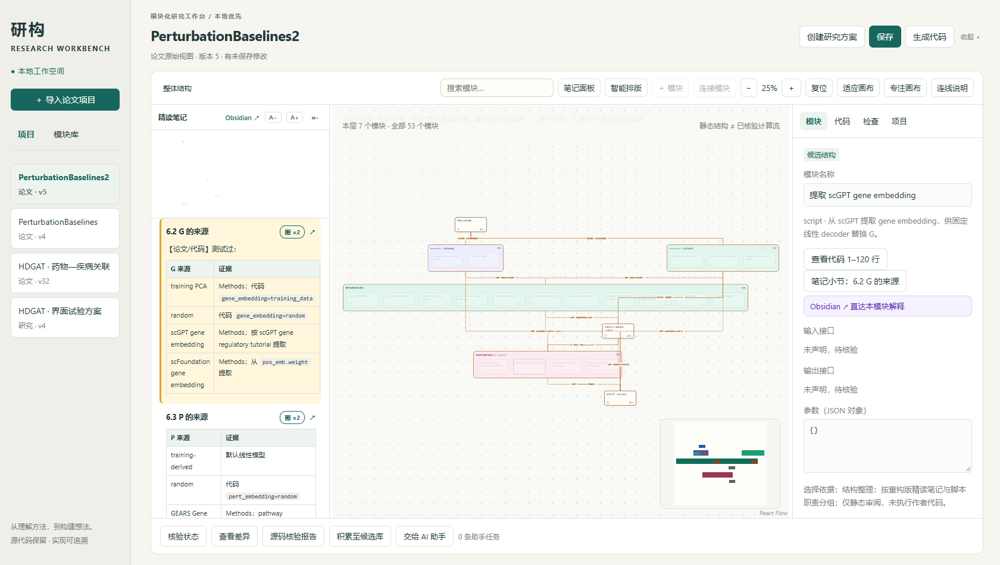

# 研构 · Research Workbench

把论文精读笔记和代码目录整理成可追溯、可展开的模块图。项目默认只在本机运行，作者原始代码不被修改，也不把导入代码自动执行。



## 快速开始

需要 Python 3.9+：

```bash
python server.py --workspace demo-workspace --open
```

打开 `http://127.0.0.1:8765`，进入 `PerturbationBaselines2` 即可查看完整示例。`demo-workspace` 默认只读。仓库自带的 `static/` 是预构建前端，普通使用不需要 Node.js。

## 重要：完整工作流需要配套 skill

导入代码和精读笔记后，工作台首先只能生成 **AST 候选图**，不会自动判断论文逻辑、不会自动把节点映射到笔记小节，也不会自动完成代码适配和证据核验。

完整的“笔记驱动模块图 + 代码同步 + checkpoint/attest/verify”流程依赖仓库内的配套 skill：

- `skills/research-module-sync/SKILL.md`
- `skills/research-module-sync/references/workflow.md`

安装到本机 Codex：

```bash
python install_skill.py
```

安装位置通常是：

```text
~/.codex/skills/research-module-sync
```

如果目标已存在，安装脚本会拒绝覆盖，先人工检查后再处理。使用其他 AI 时，可以直接让它读取仓库中的 `skills/research-module-sync/SKILL.md` 和 `references/workflow.md`。

没有 skill 时，你仍可以浏览演示图、查看导入候选和阅读笔记；但不能把静态候选图当作已经完成论文逻辑拆解或代码核验。

## 笔记是否必需

不是必须上传到 GitHub，也不要求把私人笔记放进公开仓库。

- 浏览自带 demo：不需要额外笔记。
- 导入自己的代码：`note_path` 现在是可选的，不填也能建立“仅代码候选图”。
- 使用完整笔记驱动流程：需要一份本地笔记，并配合 `research-module-sync` skill。
- 私人笔记只在本机读取；工作台会把 `note_text` 缓存在本机的 `project.json` 中，所以不要把不希望披露的项目 workspace 公开分享。

代码-only 导入适合先看模型结构、函数分层和源码位置；笔记锚定、论文/代码冲突说明和完整语义核验仍需要笔记。

## 数据保存在哪里

- `demo-workspace/`：随 Git 仓库发布的演示数据，默认只读。不要在这里导入个人论文。
- `workspace/`：个人项目的默认位置，已写入 `.gitignore`，不会被普通 `git add` 提交。一键启动脚本会先把 demo 复制到这里，再允许保存和导入。
- 仓库外目录：也可以给个人项目指定独立路径，例如：

```bash
python server.py --workspace "D:\ResearchWorkbench\workspace" --open
```

个人项目通常保存在：

```text
workspace/projects/<项目 UUID>/
  project.json          图结构、笔记缓存、哈希与元数据
  original/             导入时的原始快照，禁止修改
  working/              研究工作副本
  versions/             版本快照
  assistant-checkpoints/可恢复检查点
  assistant-reports/    AI 审阅与证据报告
  exports/              导出的独立工程
  tasks/                外部 AI 任务队列
```

注意：提供笔记时，笔记正文会缓存在本机的 `project.json`。如果笔记是私密的，请保持 `workspace/` 不被提交，或者使用仓库外的 workspace 路径。只有开发 demo 本身时，才应显式使用 `--allow-demo-edit`。
## 一键启动

- Windows：双击 `start.bat`，或在 PowerShell 中运行 `.\start.ps1`
- macOS / Linux：运行 `./start.sh`
- 让 AI 自动安装：把 `INSTALL_WITH_AI.md` 中的提示词复制给 AI
- Docker：运行 `docker compose up --build`

## 特性

- 笔记驱动的分层模块图：从论文实验地图展开到脚本和代码锚点。
- 保留作者原始代码，研究工作副本独立存在。
- React Flow + 本地 ELK 布局，支持分组折叠、搜索定位、节点与笔记双向高亮。
- 代码-only 和笔记驱动两种起步方式。
- 图上只展示可追溯的代码位置；推断关系明确标记为“推断”。
- 本地文件优先，不依赖模型 API、云数据库或运行时 CDN。

## 自带示例

`demo-workspace/projects/b32e5244-c083-4ade-9b11-dc386ab17901` 展示的是 *Deep-learning-based gene perturbation effect prediction does not yet outperform simple linear baselines* 的重构版精读结果：

- 7 个按论文论证顺序组织的主模块；
- 23 个脚本模块；
- 23 个 AST 候选节点；
- 12 条有明确标签的跨章节边；
- 53/53 个笔记锚点。

对应笔记在 `demo-workspace/notes/`。上游代码采用 MIT License，版权和许可证随 `original/` 与 `working/` 一并保留。

## 目录

```text
server.py / backend.py / assistant.py   本地后端与检查工具
static/                                 预构建浏览器应用
frontend/                               React Flow 前端源码与构建脚本
skills/research-module-sync/            完整工作流必需的助手 skill
demo-workspace/                         演示项目、笔记与 MIT 上游代码
tests/                                  Python 标准库测试
docs/evidence/                         示例结构整理报告与审计图
third_party_licenses/                  第三方许可证文本
```

## 重建前端

只有修改前端源码时才需要 Node.js：

```bash
cd frontend
npm ci
node build.mjs
```

构建产物写回 `static/bundle/`。

## 测试

```bash
python -m unittest discover -s tests -v
python assistant.py verify demo-workspace/projects/b32e5244-c083-4ade-9b11-dc386ab17901
```

## 设计边界

- 静态结构不等于已核验计算流。
- 未提供笔记时不会自动生成笔记锚点或论文/代码对应说明。
- 未适配的研究图导出后会标记 `needs_adaptation`。
- 本项目不声称自动复现论文训练结果，也不把作者源码替代成未经验证的实现。
- 导入代码默认不执行；需要运行时必须由用户显式发起独立适配任务。

## 许可证

应用代码采用 MIT License。第三方依赖和示例上游代码的许可证见 `THIRD_PARTY_NOTICES.md` 与 `third_party_licenses/`。