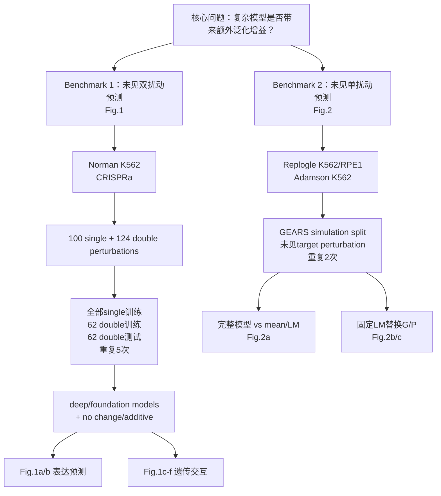
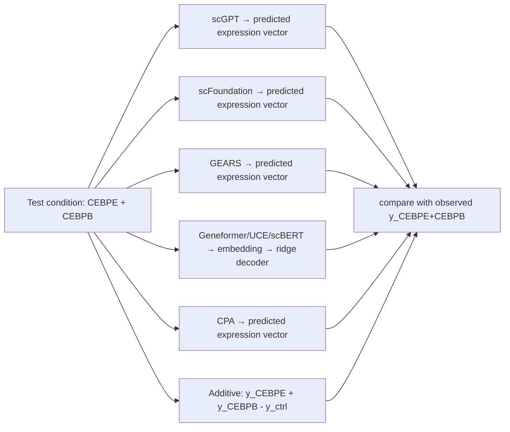
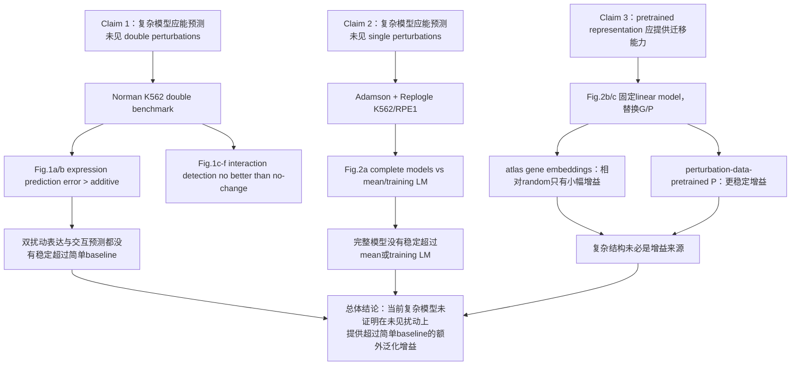

# Deep-learning-based gene perturbation effect prediction does not yet outperform simple linear baselines

> [!info] 版本说明
> 这是完全重构版，原文件 `PerturbationBaselines-01-精读笔记.md` 保留不覆盖。本文按 experiment 纵向组织：先讲清每个 benchmark 的数据、split、模型、baseline、输出和指标，再讨论结论。

> [!important] 证据标记
> - **【论文】**：直接来自论文正文、Methods、Fig.1/2 caption 或 Extended Data caption。
> - **【代码】**：由论文官方 GitHub commit `bfa6eeea2bd145a1af2ec0127a2e808cc38456a9` 的脚本核验；是第二证据层，不自动等同于论文陈述。
> - **【推断】**：根据已核实事实做的教学解释，不冒充论文原文。
> - **【冲突】**：论文不同位置、图注或官方代码之间存在不一致，本文并列记录，不替作者裁决。

## 基本信息

| 项目 | 内容 |
| --- | --- |
| 作者 | Constantin Ahlmann-Eltze、Wolfgang Huber、Simon Anders |
| 年份 | 2025 |
| 来源 | Nature Methods 22, 1657–1661, Brief Communication |
| DOI | https://doi.org/10.1038/s41592-025-02772-6 |
| PDF 依据 | Zotero 附件 `QKTPEMRD`；正文 p.1657–1661；Methods p.6–7；Extended Data Fig.1–10 |
| 代码依据 | `github.com/const-ae/linear_perturbation_prediction-Paper`，commit `bfa6eeea2bd145a1af2ec0127a2e808cc38456a9` |
| 数据例子 | [[20_学术研究/数据积累/数据例子-PerturbationBaselines|PerturbationBaselines 数据例子]] |
| 路线拆解 | [[20_学术研究/文献库/导学/精读笔记/PerturbationBaselines-02-研究路线拆解|PerturbationBaselines 研究路线拆解]] |

## 一句话摘要

> 论文用两个彼此独立的 benchmark 检查：复杂基础模型和深度扰动模型，是否能在未见双扰动与未见单扰动上提供超过 additivity、训练均值或低维线性模型的额外泛化增益；结果显示没有稳定增益。

## 📚 零基础概念导读

| 顺序 | 概念 | 先记住的一句话 |
| --- | --- | --- |
| 1 | [[基因扰动效应预测]] | 输入扰动条件，预测扰动后一组基因的表达。 |
| 2 | [[单细胞基因表达与伪bulk]] | 单细胞矩阵按扰动条件求均值后，才成为条件级表达向量。 |
| 3 | [[细胞基础模型]] | 预训练表示、任务头和最终 decoder 必须分开审计。 |
| 4 | [[线性模型与岭回归]] | 本文用 `Y≈GWPᵀ+b` 判断低维线性结构能否替代复杂模型。 |
| 5 | [[遗传交互与加性基线]] | 双扰动偏离两个单扰动加性期望，才形成交互候选。 |
| 6 | [[Warm Start、Cold Start与交叉验证]] | “未见扰动”与随机留出细胞不是同一种泛化。 |
| 7 | [[预测模型评价指标]] | L2、Pearson delta、TPR–FDP 各自评价不同能力。 |

## 1. 论文到底在问什么

论文不是简单地问：

> 神经网络和线性回归谁更强？

它真正问的是：

> **当前单细胞基础模型和深度扰动模型，是否在预测未执行过的 perturbation 时，比非常简单的规则或低维线性模型提供了额外泛化能力？**

这里的“额外泛化增益”是指：

- 模型不只是在训练时见过的 perturbation 上拟合得好；
- 它能对训练中完全没有见过的 single perturbation，或没有作为组合出现过的 double perturbation，产生有用预测；
- 而且这种预测能力在相同数据、相同 split、相同输出和相同 metrics 下，必须超过简单 baseline。

【推断】因此，“模型更复杂”本身不是论文关心的变量；论文关心的是复杂度是否转化为 unseen perturbation 上的预测能力。

## 2. 论文实验地图



关键区别：

| 实验       | 测试什么“没见过”                      | 主要数据                       | 主要 baseline                             | 主要问题                        |
| -------- | ------------------------------ | -------------------------- | --------------------------------------- | --------------------------- |
| Fig.1    | 未见 double perturbation 组合      | Norman K562                | no change、additive                      | 组合外推与 genetic interaction   |
| Fig.2a   | 未见 single perturbation target  | Adamson、Replogle K562/RPE1 | mean、training linear model              | 跨 perturbation 外推           |
| Fig.2b/c | 固定线性 decoder，替换 representation | 同 Fig.2a                   | training PCA/random/external embeddings | 增益来自 representation 还是复杂结构？ |

## 3. Benchmark 1：未见双扰动预测

### 3.1 科学问题

训练中已经见过：

- 单扰动 A；
- 单扰动 B；
- 以及一部分其他双扰动。

测试时要预测：

> **A+B 这个组合在训练中从未作为 perturbation condition 出现时的表达结果。**

【推断】这里检验的是“组合外推”：模型能否从单扰动效应和其他双扰动的训练经验，推断一个未见组合。

### 3.2 数据

【论文】数据来自 Norman et al. 的 K562 CRISPR activation 实验：

| 项目          | 内容                         |
| ----------- | -------------------------- |
| 细胞系         | K562                       |
| 扰动方式        | CRISPR activation（CRISPRa） |
| 单基因扰动       | 100 个                      |
| 双基因扰动       | 124 对                      |
| 对照          | no-perturbation control    |
| 表达维度        | 19,264 个基因的对数 RNA-seq 表达值  |
| 主要 read-out | control 中表达量最高的 1,000 个基因  |

一个 perturbation condition 最终对应：

```text
该条件下的多个单细胞
→ 按基因求条件 pseudobulk 均值
→ 一条 expression vector
→ 作为 Y 中的一列
```

【论文】正文所称的 phenotypes 是 log RNA-seq expression values，不是原始 UMI counts。

### 3.3 Train / test split

```text
100 个 single perturbations
→ 全部进入训练

124 个 double perturbations
→ 随机分成：
   ├── 62 个进入训练
   └── 62 个留作测试

整个“随机划分 + 训练 + 测试”流程
→ 重复 5 次
```

【论文】测试单位是未见 double perturbation combination，不是随机留出的单个细胞。

【论文】“no change”和“additive”两个 baseline 都不使用 double perturbation training data。

### 3.4 哪些模型参与 Benchmark 1

【论文】比较了五个 foundation models 和两个其他 deep learning models，再加上简单 baseline：

| 模型           | 是否参与 double benchmark | 主要入口                                                                           |
| ------------ | --------------------- | ------------------------------------------------------------------------------ |
| scGPT        | 是                     | perturbation tutorial                                                          |
| scFoundation | 是                     | GEARS v0.0.2 fork                                                              |
| UCE          | 是                     | zero-shot，额外 ridge decoder                                                     |
| scBERT       | 是                     | fine-tune perturbation labels，额外 ridge decoder                                 |
| Geneformer   | 是                     | fine-tune perturbation labels，built-in in silico perturbation，额外 ridge decoder |
| GEARS        | 是                     | GEARS API                                                                      |
| CPA          | 是                     | Norman combinatorial tutorial                                                  |
| no change    | 是                     | 直接预测 control                                                                   |
| additive     | 是                     | 单扰动观测向量相加                                                                      |

模型如何从输入变成 prediction，见第 8 节总表。

### 3.5 Baseline 1：No change

【论文】对每个 double perturbation：

$$
\hat y_{A+B}=y_{\varnothing}
$$

- 输入不是 perturbation 表达，而是 control condition；
- 不需要训练；
- 输出是 control 条件下的表达向量；
- 它测试的是“完全预测没有变化”这一极端简单规则。

### 3.6 Baseline 2：Additive

【论文】对 double perturbation A+B：

$$
\hat y_{A+B}=y_A+y_B-y_{\varnothing}
$$

其中：

- `y_A`：单扰动 A 的平均观测表达向量；
- `y_B`：单扰动 B 的平均观测表达向量；
- `y_∅`：无扰动 control 表达向量；
- 公式等价于把 A、B 相对 control 的 LFC 相加。

【论文】该模型不使用任何 double perturbation 训练数据。

直观例子：

```text
control expression: y_empty
single A: y_A
single B: y_B

A 的变化量: y_A - y_empty
B 的变化量: y_B - y_empty

预测 A+B:
y_empty + (y_A-y_empty) + (y_B-y_empty)
= y_A + y_B - y_empty
```

【推断】additive 是 expression prediction 的有力 baseline，但它按定义不会产生非加性 interaction，因此不能用于“发现 interaction”。

【论文】Methods 还把 additive 描述为线性模型式 (1) 的一个特例：

- `G = Y_single`；
- `P` 是对被扰动 gene 的 binary coding；
- `W` 是 identity matrix；
- `b = -y_∅`。

这说明 additive 不是与线性模型无关的规则，而是同一条件级表达框架中的一个极端简单实例。

### 3.7 一条测试样本怎样走完整流程

【论文】Fig.1b 使用 `CEBPE + CEBPB` 作为测试 double perturbation 示例。



最终比较的不是模型名称，而是：

【论文/源数据】Fig.1b 给出的 `CEBPE + CEBPB` 示例中，additive 约为 `L2=4.7`、Pearson delta `R2≈0.93`；源数据中对应记录为 `L2≈4.6608`、`R2_delta≈0.9271`，与图中四舍五入值一致。

```text
每个方法输出一个 predicted expression vector ŷ
真实实验给出一个 observed expression vector y
→ 在共同 read-out genes 上算误差
```

### 3.8 Fig.1a/b：表达预测

【论文】Fig.1a：62 个 held-out double perturbations × 5 次 split 的 L2 error beeswarm。

【论文】误差定义：

$$
L2(\hat y,y)=\sqrt{\sum_g(\hat y_g-y_g)^2}
$$

它也是 root mean squared error，针对 control 中表达量最高的 `n=1,000` 个基因。

【论文】Pearson delta：

$$
\mathrm{PearsonDelta}(\hat y,y)=\mathrm{cor}(\hat y-y_{\varnothing},y-y_{\varnothing})
$$

- L2：同时惩罚方向和幅度误差；
- Pearson delta：先减 control，再评价变化方向的一致性，不惩罚系统性幅度偏大或偏小；
- Fig.1b：用 `CEBPE+CEBPB` 展示 observed vs predicted 的散点图。

【论文】Extended Data Fig.2 还测试了不同 read-out gene 数量和 differential expression 排序；作者指出按真实 differential expression 排序在真实使用场景中不可用，因为需要 ground truth。

### 3.9 Fig.1c–f：遗传交互

这是同一个 double perturbation benchmark 的第二个问题。

#### 什么算 genetic interaction

【论文】先构造 additive expectation：

```text
observed expression - additive expectation = interaction deviation
```

- 偏离接近 0：additive / non-interaction；
- 偏离显著：genetic interaction candidate。

【论文】作者对 124 个 double perturbations × 1,000 read-out genes 计算 observed minus additive expectation，并用 Efron empirical null（`locfdr` 1.1-8）识别交互。

【论文】共识别 5,035 个 interactions，候选空间为 124×1,000=124,000，FDR=5%。

#### 交互类别

| 类别 | 定义 |
| --- | --- |
| buffering | 双扰动 LFC 位于 0 与 additive expectation 之间 |
| synergistic | 双扰动效应超过 additive expectation |
| opposite | 双扰动方向与单扰动相反 |
| other | 两个单扰动方向相反等无法归入前类 |

【论文】在 read-out gene values 中：buffering 2.3%，synergistic 0.6%，opposite 0%。

#### 模型如何被评价为“发现交互”

【论文】对每个方法的 prediction：

1. 计算 predicted expression 相对 additive expectation 的偏离；
2. 偏离越大，越像 interaction；
3. 对阈值 `D` 的不同取值，计算 TPR 和 false discovery proportion；
4. 得到 Fig.1c 曲线。

【论文】additive baseline 不参加 interaction 排名，因为它的偏离按定义就是 0。

【论文】Fig.1d/e 展示 interaction class 定义和观测组成；Fig.1f 展示 observed/predicted deviation from additive expectation。

用文字表示其核心含义：

```text
FDP(l) = 前 l 个预测交互中实际非交互的比例
TPR(l) = 前 l 个预测交互中找回的真实交互数 / 全部真实交互数
```

作者先按模型预测偏离 additive expectation 的大小排序，再在固定 FDP 下观察能找回多少真实 interaction。【论文】作者选择 FDP–TPR 而不是只画 precision-recall，是因为它直接回答“在固定 false-positive fraction 下找回多少 interactions”。

### 3.10 Benchmark 1 结果

【论文】表达预测：

- 所有模型 prediction error 都明显高于 additive baseline；
- Extended Data Fig.2 的其他 metrics 得到相同总体结果。

【论文】interaction prediction：

- 没有模型优于 no-change baseline；
- 模型很少预测 synergistic interactions；
- 多数模型偏向 buffering；
- 即使模型预测 synergistic，正确率也很低；
- scGPT、UCE、scBERT 的预测在很多基因上不随 perturbation 改变；
- GEARS 和 scFoundation 的变化幅度也明显小于 ground truth。

【论文】Extended Data Fig.5/6：HBG2 和 HBZ 在多个模型的前列预测中反复出现；某些模型对这两个强单扰动基因的组合预测接近 no-change。

【论文】Extended Data Fig.4：作者还报告了 precision-recall 和 ROC curve，并给出五个 split 的 AUC；模型排序与 Fig.1c 一致。

### 3.11 Benchmark 1 结论

正确表述是：

> 在 Norman K562 double perturbation benchmark、当前模型实现和当前评价条件下，复杂模型没有稳定超过 additive expression baseline；interaction detection 也没有稳定超过 no-change baseline。

不能写成：

> 所有深度模型在生物任务中一般都没有用。

## 4. Benchmark 2：未见单扰动预测

### 4.1 科学问题

Benchmark 1 预测的是未见组合 `A+B`；Benchmark 2 预测的是：

> **训练集中根本没有某个 perturbation target X 的条件，现在要预测扰动 X 后的表达。**

【推断】这检验的是跨 perturbation target 的泛化，而不是同一 perturbation 下随机留出细胞。

### 4.2 数据

【论文】使用三套 CRISPR interference 数据：

| 数据集 | 细胞系 | 来源版本 | 论文中的主要用途 |
| --- | --- | --- | --- |
| Replogle K562 essential | K562 | GEARS 提供 | unseen single perturbation |
| Replogle RPE1 essential | RPE1 | GEARS 提供 | unseen single perturbation |
| Adamson | K562 | GEARS 提供 | unseen single perturbation |

【论文】Methods 明确指出：single gene perturbation benchmarks 使用 Adamson 与 Replogle 数据，并以 GEARS 提供的版本为准。

### 4.3 GEARS simulation split

【论文】作者使用 GEARS 的 `simulation` test-training splitting procedure，并重复两次。

【论文】没有在本文 Methods 中展开 simulation split 的内部算法。因此本笔记只写确定的边界：

- split 按 perturbation 组织；
- test perturbation target 对训练不可见；
- 不是简单地随机留出细胞；
- 重复两次以降低单次 split 的偶然性。

【未解决】如果需要知道 simulation split 具体如何按 gene/pathway 分组，需要继续查 GEARS 的对应实现；本文没有给出更细规则，不能自行补写。

### 4.4 Baseline 1：Mean

【论文】mean baseline：

> 对每个 read-out gene，预测训练集中所有 perturbation conditions 下的平均表达。

【代码】`run_mean_prediction.R` 逻辑：

```text
读取 perturb_processed.h5ad
→ 按 condition pseudobulk
→ 取 training conditions
→ 对每个 gene 计算 training 条件均值
→ 对每个测试 perturbation 重复输出同一个向量
```

它不使用测试 perturbation 的标签，也不使用任何 test-specific input。

### 4.5 Baseline 2：Training linear model

这是论文最重要的简单 baseline。不要直接从公式开始，先看数据。

#### 4.5.1 Y_train 是什么

【论文】令 `Y_train` 为：

```text
行 = read-out genes
列 = perturbation conditions
一个元素 = 某 gene 在某 condition 下的 pseudobulk 表达
```

示意：

```text
             perturb A   perturb B   perturb C
gene 1          ...         ...         ...
gene 2          ...         ...         ...
gene 3          ...         ...         ...
...
```

#### 4.5.2 先求 b

【论文】`b` 是 `Y_train` 的 row means，也就是每个 read-out gene 在训练 conditions 上的平均表达。

#### 4.5.3 对 Y_train 做 PCA，得到 G

【论文】对 `Y_train` 做 PCA，取前 `K` 个 principal components 作为：

$$
G \in \mathbb{R}^{|\text{read-out genes}|\times K}
$$

- 每一行：一个 read-out gene 的低维 representation；
- 每一列：一个 latent component；
- Methods 说明 `K=10`。

【推断】PCA 在这里不是预测器，而是在为每个 gene 构造可比较的低维坐标。

#### 4.5.4 从 G 中取被扰动 gene，形成 P_train

【论文】训练集中被扰动的 gene 本身也是 read-out gene，因此它已经在 `G` 中有一行。

```text
G:
  gene A  ← 训练 target
  gene B  ← 训练 target
  gene C
  gene D  ← 训练 target
  ...

取 training perturbed genes 对应的行
↓
P_train
```

因此：

- `P_train` 的行对应训练 condition 的 target gene；
- 它不是一个额外训练出来的自由参数，而是从 gene embedding `G` 中取出的子矩阵。

需要特别注意：

> 这里使用的是 **被扰动 gene 本身的 representation**，而不是任意一个“perturbation ID embedding”。这为后续预测未见 target X 留下了入口。

#### 4.5.5 拟合 W

【论文】线性模型为：

$$
Y_{train}\approx GWP_{train}^T+b
$$

其中：

- `G`：read-out gene × K；
- `P_train`：training perturbations × L；
- `W`：K × L；
- `b`：每个 read-out gene 的 baseline。

【论文】作者用 ridge normal equations 求解：

$$
W=(G^{T}G+\lambda I)^{-1}G^{T}(Y_{train}-b)P_{train}(P_{train}^{T}P_{train}+\lambda I)^{-1}
$$

- `λ=0.1`；
- 用于数值稳定性；
- 代码中 `run_linear_pretrained_model.R` 的 ridge fit 与此一致。

【推断】可以把 `W` 理解为：把 perturbation representation 所在的 latent space 映射到 read-out gene response latent space。

#### 4.5.6 未见 perturbation X 怎么预测

测试 target X 没有作为 perturbation condition 出现在训练集中，但 X 仍然可能是 read-out gene，因此它在 `G` 中有：

$$
g_X
$$

作者取测试 perturbation target 在 `G` 中的对应行作为：

$$
p_X=g_X
$$

再代入：

$$
\hat y_X=GWp_X+b
$$

【推断】这就是线性模型能预测 unseen single perturbation 的关键：模型不是查 X 的 perturbation label，而是把 X 的 gene representation 当作 perturbation representation。

### 4.6 NumPy / R 矩阵方向提醒

【论文】用矩阵记号时：

```text
G: genes × K
P: perturbations × L
W: K × L
Y: genes × perturbations
```

【代码】官方 R 代码内部会转置 embedding，并匹配 gene names，所以读代码时可能看到：

```text
pert_emb: components × genes
```

但语义不变：测试 perturbation 的 representation 来自其 target gene 在 G 中的行。

## 5. Fig.2a：完整模型和 baseline 的比较

### 5.1 完整模型

【论文】参与 Fig.2a 的 deep/foundation models：

- scGPT
- UCE
- scBERT
- Geneformer
- GEARS

### 5.2 两个缺席模型

【论文】scFoundation 没有参加 single perturbation Fig.2a，因为：

> 它要求每个数据集精确匹配其 pretraining data 中的 genes；Adamson 和 Replogle 中大多数所需 genes 缺失。

【论文】CPA 没有参加 single perturbation Fig.2a，因为：

> CPA 不是为预测 unseen perturbations 设计的。

【推断】这不是随意漏掉，而是模型接口和任务假设不匹配；论文因此在 double benchmark 中包含 CPA，但在 unseen single benchmark 中不包含。

### 5.3 Baseline

【论文】Fig.2a 主要比较：

- mean baseline；
- linear model based on training；
- 完整 deep/foundation models。

### 5.4 公平比较集合

【论文】并不是所有模型都能为所有 unseen perturbations 输出 prediction。例如 training linear model 只能预测 target gene 也在 read-out genes 中的 perturbation。

【论文】作者因此限制到：

> **所有模型都能提供 prediction 的共同 perturbation subset。**

Methods 写的是：

- Adamson：73 perturbations；
- Replogle K562：398；
- Replogle RPE1：629。

【冲突】Fig.2 caption 写的是 134、210、24 个 unseen single perturbations；Methods 的数字不同，官方 source-data 的逐 split 数量又不同。本笔记不裁决，详见第 11 节 discrepancy ledger。

### 5.5 Fig.2a 结果

【论文】没有 deep learning model 能持续超过：

- mean prediction；
- training linear model。

【论文】这意味着在当前 single perturbation benchmark 下，复杂模型至少没有稳定提供超过简单规则或低维线性模型的额外泛化增益。

### 5.6 Extended Data Fig.8

【论文】Extended Data Fig.8 使用：

- Pearson delta；
- 不同数量的 read-out genes；
- control expression ranking；
- differential expression ranking。

结果与主图一致：单扰动任务中复杂模型没有显示稳定优势。

### 5.7 Extended Data Fig.9–10

- 【论文】Extended Data Fig.9：transfer prediction accuracy 与 K562/RPE1 之间的 gene expression similarity 有关。主文总结为：两个细胞系中越相似的 gene，transfer prediction 越准确。
- 【论文】Extended Data Fig.10：记录 fine-tune 和 double perturbation prediction 的 elapsed time 与 peak memory；计算资源消耗明显，但正文没有把资源消耗直接当作精度证据。

## 6. Fig.2b/c：固定线性模型，替换 G 或 P

### 6.1 这不是另一个完整模型 benchmark

Fig.2c 不看新的网络 architecture，而是固定：

$$
Y\approx GWP^T+b
$$

只替换：

- gene representation `G`；
- perturbation representation `P`；
- 然后重新拟合 `W` 并评价预测。

【推断】它问的是：

> 深度模型的优势来自复杂 decoder/architecture，还是来自 pretrained representation 本身？

### 6.2 G 的来源

【论文/代码】测试过：

| G 来源 | 证据 |
| --- | --- |
| training PCA | Methods；代码 `gene_embedding=training_data` |
| random | 代码 `gene_embedding=random` |
| scGPT gene embedding | Methods；按 scGPT gene regulatory tutorial 提取 |
| scFoundation gene embedding | Methods；从 `pos_emb.weight` 提取 |

### 6.3 P 的来源

| P 来源 | 证据 |
| --- | --- |
| training-derived | 默认线性模型 |
| random | 代码 `pert_embedding=random` |
| GEARS Gene Ontology embedding | Methods；pathway membership matrix 的 spectral embedding |
| Replogle perturbation-data embedding | Methods；对 reference perturbation means 做 10-dimensional PCA |

【论文】Replogle transfer 规则：

- 用 K562 作为 Adamson 和 RPE1 的 pretraining source；
- 用 RPE1 作为 K562 的 pretraining source。

### 6.4 组合实验表

| 实验 | G 来源 | P 来源 | W 是否重新拟合 | 主要想检验 |
| --- | --- | --- | --- | --- |
| LM training | training PCA | training-derived | 是 | 低维线性结构本身 |
| LM random-G | random | training/pretrained | 是 | G 是否必须包含训练信息 |
| LM random-P | training PCA/random | random | 是 | P 是否提供真实 perturbation 关系 |
| LM scGPT-G | scGPT | training/external | 是 | atlas gene representation 的增量 |
| LM scFoundation-G | scFoundation | training/external | 是 | atlas gene representation 的增量 |
| LM GEARS-P | training/scGPT-G | GEARS GO | 是 | GO perturbation prior 的增量 |
| LM Replogle-P | training/scGPT-G | Replogle PCA | 是 | perturbation-data pretraining 的增量 |

### 6.5 Fig.2c 结果

【论文】使用外部 embedding 的 linear model：

- 与 scGPT/GEARS 的自带 decoder 相比，表现相同或更好；
- scPrompt/scFoundation 的 gene embeddings 超过 mean baseline；
- 但没有持续超过使用 training data G/P 的 linear model；
- 使用 Replogle perturbation data pretrained 的 P 的 linear model，一致超过所有其他模型。

【论文】总体解释：

> single-cell atlas pretraining 相对 random embeddings 只提供小幅收益；
> perturbation-data pretraining 提供了更明显的预测增益。

### 6.6 这一节能说明什么

【推断】它可以部分拆分：

- representation 的贡献（替换 G/P）；
- decoder/architecture 的贡献（固定 W 线性解码）。

但它仍不能证明“某个 pretrained representation 在所有 unseen perturbation 任务中普遍更好”；结论受 current data、split、gene matching 和 evaluation protocol 限制。

## 7. 每个模型到底经过了什么

> 本表尽量按【论文】和【代码】填写；两者没有说明的细节明确标出，不用通用领域知识补全。

| 模型 | pretraining | 当前 benchmark 是否微调 | perturbation 如何施加 | 中间 representation | expression prediction 怎样产生 |
| --- | --- | --- | --- | --- | --- |
| scGPT | 单细胞 foundation model | 【论文】使用官方 perturbation tutorial 的代码和参数；具体 loss/训练细节本文未展开 | 【论文】通过官方 tutorial 的 perturbation workflow | 模型内部 cell/gene representation | 直接输出 predicted expression |
| scFoundation | 单细胞 foundation model | 【论文】fine-tune；【代码】GEARS v0.0.2 fork，`finetune_method="frozen"`，3 天限制，5 epochs；该 upstream 设置的精确含义本文未说明 | 【论文】官方 GEARS-style API 接收 perturbation | 预训练模型与 GEARS 融合的 representation | API 直接输出 expression change prediction |
| GEARS | 无 single-cell foundation pretraining；使用 GO prior | 【论文】在当前数据上训练并用 GEARS API fine-tune | GO pathway membership + perturbation 条件 | 模型内部 perturbation/gene representation | `gears_model.predict()` 输出 predicted expression |
| CPA | 无 foundation pretraining；组合扰动模型 | 【论文】按 Norman combinatorial CRISPR tutorial 训练/test；不是 fine-tune foundation model | perturbation condition 以 CPA 的 condition/perturbation 接口进入 | CPA latent representation | 从 CPA decoder 得到 perturbation expression prediction |
| Geneformer | 单细胞 foundation model | 【论文】fine-tune：预测训练数据的 perturbation labels；【代码】fine-tune 后使用 built-in in silico perturbation | built-in in silico perturbation：delete 或 overexpress target gene | perturbed cell embedding（CLS） | 额外 ridge regression linear decoder 从 embedding 预测 expression |
| UCE | 单细胞 foundation model；zero-shot 设计 | 【论文】不 fine-tune；报告 4-layer 版本 | 【论文】没有 in silico perturbation API；用 unperturbed expression matrix，并覆盖 perturbed genes 的 rows with ground-truth expression | UCE cell embedding | 额外 ridge regression linear decoder |
| scBERT | 单细胞 foundation model | 【论文】fine-tune：预测训练 perturbation labels；【代码】fine-tune 后做 in silico 风格 embedding | 与 UCE 相同：覆盖 perturbed gene rows；代码明确存在 test leakage 风险 | scBERT attention-sum embedding | 额外 ridge regression linear decoder |
| Linear model | 无，除非显式替换为外部 G/P | 不 fine-tune deep network；只拟合 ridge W | test target gene X 的 gene embedding `g_X` 作为 `p_X` | G、P、W | `ŷ_X=GWp_X+b` |
| Additive | 无 | 无 | 单扰动 A、B 的 observed mean vectors | `y_A,y_B,y_∅` | `ŷ_A+B=y_A+y_B-y_∅` |
| Mean | 无 | 无 | 不依赖 perturbation-specific input | training conditions 的 row means | 每个测试 perturbation 都输出同一平均表达向量 |

### 模型版本与设置

【论文】Methods 报告的版本：

| 模型 | 版本/来源 |
| --- | --- |
| GEARS | 0.1.2 |
| scGPT | 0.2.1 |
| scFoundation | 基于 GEARS 0.0.2 fork |
| CPA | 0.8.8 |
| Geneformer | 0.1.0 |
| scBERT | commit `262fd4b9`，模型权重由作者提供 |
| UCE | commit `8227a65c`，报告 4-layer 版本 |

【论文】作者尽量使用各模型默认参数；scFoundation 的 fine-tuning 限时 3 天，实际训练 5 个 epochs；作者报告 4-layer 与 33-layer UCE 没有性能差异。

### 证据边界

- **论文明确写明**：GEARS/scFoundation API、scGPT tutorial、CPA tutorial、Geneformer in silico perturbation、UCE 零样本与覆盖 ground truth、scBERT 同样覆盖 ground truth、三种模型需要额外 ridge decoder。
- **官方代码核验**：具体 embedding 提取、UCE/scBERT 的覆盖操作、linear model 的 G/P 替换选项、scFoundation 的 `finetune_method="frozen"`。
- **本文没有报告**：多数模型 optimizer、batch size、learning rate、完整 epoch schedule，以及所有 upstream architecture 的内部细节。不要用一般模型论文知识补写到“本文明确说明”里。
- 【冲突/待核】scFoundation 在论文文字中称为 fine-tune，但代码参数是 `finetune_method="frozen"`；需要查 upstream scFoundation/GEARS 代码才能解释该参数具体冻结了什么。

## 8. 论文完整论证链



## 9. 公式索引

> 公式索引只用于快速定位；公式的完整解释都在对应实验流程中。

| 公式/指标 | 所在实验 | 作用 |
| --- | --- | --- |
| `ŷ_A+B=y_A+y_B-y_∅` | Benchmark 1 additive | 表达预测 baseline |
| `L2(ŷ,y)` | Benchmark 1/2 | 绝对误差 |
| `PearsonDelta(ŷ,y)` | Benchmark 1/2 | 去 control 后的方向相关 |
| FDP / TPR | Benchmark 1 interaction | 交互候选发现 |
| `Y≈GWPᵀ+b` | Benchmark 2 linear model | 低维条件级表达模型 |
| ridge normal equations | Benchmark 2 linear model | 拟合 W |
| `p_X=g_X` | Benchmark 2 unseen prediction | 测试 target 的 perturbation representation |

## 10. 数据冲突、泄漏与公平性

### 10.1 数量冲突账本

| 主题 | 来源 A | 来源 B | 来源 C | 处理方式 |
| --- | --- | --- | --- | --- |
| Norman genes | 正文：19,264 | Extended Data Fig.10：19,624 | 下载的原始 H5AD：19,264 | 标为 discrepancy；正文与 H5AD 一致，但与 ED10 不同 |
| Norman cells | 正文未给 | ED10：81,143 | 原始 H5AD：84,986 | 标为 discrepancy；不能自行统一 |
| Norman conditions | 正文：100 single +124 double +control=225 | ED10：225 conditions | 原始 H5AD：227 categories = ctrl +101 single +125 double | 标为 discrepancy；后续分析可能继续过滤 |
| Adamson cells | ED1 table：65,899 | 下载的 `perturb_processed.h5ad`：68,603 | - | 版本/过滤差异未解释 |
| Adamson perturbations | ED1 table：81 | 下载 processed H5AD：86 non-control | - | 版本/过滤差异未解释 |
| Replogle K562 cells | ED1 table：162,264 | processed H5AD：162,751 | - | 版本/过滤差异未解释 |
| Replogle K562 perturbations | ED1 table：1,087 | processed H5AD：1,092 non-control | - | 版本/过滤差异未解释 |
| Replogle RPE1 cells | ED1 table：161,423 | processed H5AD：162,733 | - | 版本/过滤差异未解释 |
| Replogle RPE1 perturbations | ED1 table：1,534 | processed H5AD：1,543 non-control | - | 版本/过滤差异未解释 |
| Single test counts | Fig.2 caption：134 /210 /24 across two splits | Methods common subset：73/398/629 | source data per split：约 18/104/163; across two splits 36/208/326 | 标为 unresolved；不同定义和版本未对齐 |

> 说明：ED1 table 的数字来自官方 `dataset_overview.Rmd` 中用于生成 Extended Data Fig.1a 的 LaTeX 表；processed H5AD 数字来自我们下载并解析的官方数据包。两者不一致时，不应把其中一个当作唯一正确值。

### 10.2 Potential leakage

【论文】UCE：

- 没有 in silico perturbation API；
- 直接取 unperturbed cells 的表达矩阵；
- 把被扰动 gene 的 rows 替换成 ground-truth expression matrix 的值；
- 作者明确承认 test data leakage 理论上可能给模型带来优势。

【论文】scBERT：

- 使用与 UCE 相同的 embedding 构造思路；
- 因此同样存在 theoretical test leakage warning。

【推断】这不会自动解释所有结果，但它意味着 UCE/scBERT 的结果不能当作完全独立的零泄漏泛化证据。

### 10.3 公平性限制

【论文】主要限制：

- 只使用四个数据集；
- 全部来自癌症细胞系；
- 没有重新做 QC；
- 可能保留没有改变自身 target gene 的 perturbation；
- 不同模型的基因匹配和输入接口不同；
- scFoundation 在 single benchmark 中因基因不匹配缺席；
- CPA 的代码修复版本性能更差，作者最终报告 original code 的结果。

【推断】因此，论文的强结论是“在当前 benchmark 和实现下没有稳定超过简单 baseline”，不是“架构 X 在所有 perturbation 任务中一定无效”。

## 11. 研究结论

1. **Double perturbation**：在当前 Norman K562 benchmark 中，复杂模型没有稳定超过 additive expression baseline；interaction detection 也没有稳定超过 no-change baseline。
2. **Single unseen perturbation**：完整深度模型没有稳定超过 mean 或 training linear model。
3. **Representation analysis**：单细胞 atlas 预训练 gene embeddings 相对 random embeddings 只提供小幅收益；perturbation-data-pretrained P 提供了更明显的增益。
4. **总体结论**：论文质疑的是“复杂模型天然带来额外泛化能力”这一假设，而不是笼统否定深度学习方法。

## 12. 未解决问题

| 问题 | 当前已知 | 下一步 |
| --- | --- | --- |
| Fig.2 test perturbation 数量冲突 | Fig.2 caption、Methods、source data 三套数字 | 对照论文版本与官方仓库历史，确认每个数字的定义 |
| Norman 数据规模冲突 | 正文、ED10、H5AD 三套数字 | 检查 scFoundation/GEARS 每一步过滤和 QC 代码 |
| GEARS simulation split 内部规则 | 论文只说使用该 procedure | 查 GEARS 实现的 split 定义，但不要把它写成论文结论 |
| scFoundation `finetune_method="frozen"` | 论文称 fine-tune，代码参数显示 frozen | 查 upstream scFoundation/GEARS 代码，确认冻结范围 |
| 模型超参数和 optimizer | 论文绝大多数未报告 | 不补写；如需复现，查官方代码或原模型论文 |
| Zotero 父条目元数据 | 当前使用 attachment key `QKTPEMRD` | 重启/重开 Zotero 后补父条目 key |

## 13. 理解自测

1. 本文有几套 benchmark？分别测试什么“未见”对象？
2. Benchmark 1 的 100 个 single 和 124 个 double 怎样划分？测试单位是什么？
3. Additive 为什么强？为什么不能用于 interaction detection？
4. Fig.1a/b 与 Fig.1c-f 分别评价什么？
5. Benchmark 2 中 test perturbation X 为什么能被 linear model 预测？`g_X` 从哪里来？
6. `G`、`P_train`、`W`、`b` 的形状和来源分别是什么？
7. 哪个模型使用额外 ridge decoder？为什么？
8. UCE 和 scBERT 的 leakage 具体来自哪里？
9. Fig.2a 与 Fig.2c 的本质区别是什么？
10. 哪些模型没有参加 single perturbation benchmark？原因是什么？
11. 论文的哪些数量在不同位置不一致？
12. 为什么“复杂模型没有超过简单 baseline”不能改写成“深度模型普遍无效”？

<details>
<summary>参考答案与定位</summary>

1. 三套分析：Fig.1 double perturbation；Fig.2a unseen single perturbation；Fig.2b/c representation analysis。
2. 100 个 single 全部训练；124 个 double 随机分成 62 train/62 test；整个流程重复 5 次；测试单位是未见 double combination。
3. Additive 使用单扰动 observed means，不用 double training data；但按定义输出就是 additive expectation，不可能产生非加性 interaction。
4. Fig.1a/b 评价 expression prediction；Fig.1c–f 评价 interaction detection。
5. 测试 target X 虽然未作为 condition 训练，但它可能在 read-out gene 中，因此有 `g_X`；令 `p_X=g_X`，代入 `GWp_X+b`。
6. `G`：genes×K，来自训练数据 PCA；`P_train`：training targets×L，来自 G 的对应行；`W`：K×L，ridge fit；`b`：gene row means。
7. Geneformer、UCE、scBERT；它们的输出是 perturbed embedding，需要 ridge linear decoder 映射到 expression。
8. 用 unperturbed expression matrix，并把被扰动 gene rows 替换成 ground-truth expression。
9. Fig.2a 比较完整模型的端到端性能；Fig.2c 固定 linear decoder，只替换 G/P，分析 representation 的贡献。
10. scFoundation 因 gene matching 缺席；CPA 因不是为 unseen perturbations 设计而缺席。
11. Fig.2 caption vs Methods vs source data；Norman 正文/ED10/H5AD；ED1 table vs processed H5AD counts。
12. 结论受数据、split、模型实现、输入权限和评价协议限制，只能说明当前 benchmark 下没有稳定增益。

</details>

## 14. 相关文档

- 数据例子：[[20_学术研究/数据积累/数据例子-PerturbationBaselines|PerturbationBaselines 数据例子]]
- 研究路线拆解：[[20_学术研究/文献库/导学/精读笔记/PerturbationBaselines-02-研究路线拆解|PerturbationBaselines 研究路线拆解]]
- 原精读笔记（保留不覆盖）：[[20_学术研究/文献库/导学/精读笔记/PerturbationBaselines-01-精读笔记|PerturbationBaselines 原精读笔记]]
- 官方代码：https://github.com/const-ae/linear_perturbation_prediction-Paper/tree/bfa6eeea2bd145a1af2ec0127a2e808cc38456a9


